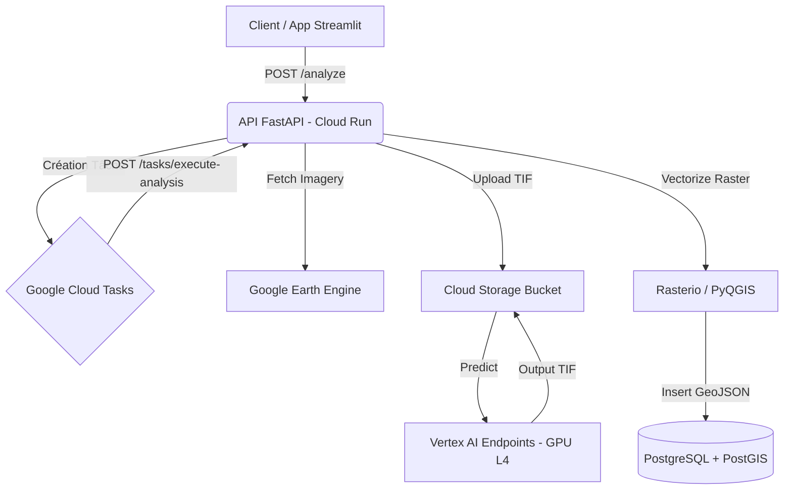

# Géo-Intelligence Artificielle en Milieu Tropical : Architecture, Méthodes et Applications pour la Prospection Minière en RDC avec GeoCongo AI

**Auteur : Gérard Cubaka**

---

## Avant-propos

La République Démocratique du Congo (RDC) repose sur un paradoxe géologique et économique : elle détient dans son sous-sol les clés de la transition énergétique mondiale (cuivre, cobalt, coltan, lithium), tout en faisant face à d'immenses défis pour cartographier, quantifier et exploiter ces ressources de manière souveraine, traçable et durable. L'exploration minière traditionnelle, coûteuse et physiquement éprouvante en milieu tropical dense, a montré ses limites. 

C'est de ce constat qu'est né **GeoCongo AI**. Mon ambition, à travers ce projet, est de doter la RDC, et plus largement le continent africain, d'un outil technologique de pointe, souverain et évolutif. En croisant l'Intelligence Artificielle (Deep Learning, Vision Transformers) et les données d'Observation de la Terre (satellites multispectraux et radar), nous ne nous contentons plus de regarder la surface ; nous prédisons ce qui se cache sous la canopée.

Ce livre documente l'architecture, les algorithmes et la vision de GeoCongo AI. Il s'adresse aux ingénieurs, data scientists, géologues et décideurs qui souhaitent comprendre et répliquer cette technologie, et qui partagent la conviction que l'IA appliquée aux géosciences est le nouveau paradigme de l'exploration minière.

---

## Partie I : Introduction et Vision Stratégique

### Chapitre 1 : Le Nouveau Front de la Prospection Minière

L'exploration minière en RDC se heurte à un obstacle naturel majeur : la forêt équatoriale et la couverture végétale dense. Les méthodes de télédétection classiques (optiques) ne pénètrent pas la canopée, rendant l'identification des affleurements rocheux ou des altérations hydrothermales extrêmement complexe.

**La révolution de l'IA et de l'observation de la Terre :**
L'avènement des modèles de fondation géospatiaux (Geospatial Foundation Models) et des constellations de satellites à haute revisite (Copernicus) modifie la donne. L'IA ne cherche plus seulement des "couleurs" (signatures spectrales pures) ; elle apprend des motifs spatiaux, texturaux et temporels complexes. GeoCongo AI exploite ces avancées pour créer un système intégré d'analyse géologique.

**Vision à long terme :**
GeoCongo AI a vocation à devenir une plateforme d'intelligence géospatiale prédictive de bout en bout. Au-delà de la détection de minéralisations existantes, le système évolue pour :
1.  Identifier des cibles d'exploration vierges (Greenfield) avec une haute probabilité de succès.
2.  Prédire quantitativement le potentiel d'un gisement (estimation de tonnage préliminaire).
3.  Recommander des méthodes d'extraction minimisant l'impact environnemental.

### Chapitre 2 : Le Paysage Concurrentiel et Notre Positionnement

Des solutions d'agritech ou de minetech telles que *Terra.eye*, *Farmonaut* ou *Solafune* utilisent déjà l'imagerie satellitaire. Cependant, la majorité de ces acteurs se concentrent sur la surveillance d'infrastructures existantes (monitoring) ou sur des zones arides où la roche est exposée (Australie, Chili).

**Le différenciateur GeoCongo AI :**
1.  **Spécialisation Tropicale :** L'architecture est pensée pour inférer la géologie à travers la végétation, en exploitant l'indice de stress végétal comme proxy géochimique.
2.  **Approche Multi-Modèles :** Au lieu d'un modèle monolithique, GeoCongo AI orchestre un ensemble de modèles spécialisés : *Prithvi-EO-V2* (minéralogie), *SAM 2* (linéaments structuraux) et *SegFormer* (couverture terrestre).
3.  **Persistance Spatiale Vectorielle :** L'intelligence ne s'arrête pas au raster. La vectorisation dynamique via PyQGIS/Rasterio et l'intégration PostGIS permettent des requêtes spatiales complexes (ex: "Trouver les intersections entre les failles majeures et les anomalies spectrales de type argileux").

---

## Partie II : Les Fondations - Données et Contexte Géoscientifique

### Chapitre 3 : Le Carburant de l'IA - Les Données Satellitaires

L'architecture de GeoCongo AI repose sur l'ingestion massive de données satellitaires via l'API Google Earth Engine (GEE).

*   **Données Multispectrales (Sentinel-2) :** L'API interroge la collection `COPERNICUS/S2_SR_HARMONIZED`. Pour le modèle Prithvi, les bandes B2 (Bleu), B3 (Vert), B4 (Rouge), B8 (NIR), B11 (SWIR1) et B12 (SWIR2) sont extraites. Les bandes SWIR (Short-Wave Infrared) sont fondamentales car elles révèlent les vibrations des liaisons moléculaires (ex: Al-OH, Mg-OH) caractéristiques des minéraux d'altération (illite, kaolinite).
*   **Vers l'Hyperspectral (Vision future) :** Les capteurs actuels (PRISMA, EnMAP) offrent plus de 200 bandes spectrales contiguës. Cela permet de passer d'une identification par "groupe de minéraux" à une identification minéralogique précise (la "signature spectrale" exacte).
*   **Radar à Synthèse d'Ouverture (SAR - Sentinel-1) :** Contrairement à l'optique, le radar (bande C ou L) pénètre la couverture nuageuse et partiellement la canopée. La rétrodiffusion radar ($\sigma^0$) permet d'extraire la rugosité de surface et la topographie (MNT), éléments clés pour identifier les structures géologiques (failles, plis) qui contrôlent la minéralisation.

### Chapitre 4 : La Clé de la Précision - Les Données Terrain (Ground Truth)

Aucun modèle IA géospatial ne peut atteindre une précision exploitable économiquement sans vérité terrain. L'équation de la prédiction géologique est mathématiquement un problème mal posé si l'on se fie uniquement à la surface.

*   **Géophysique & Géochimie :** L'intégration de levés aéromagnétiques permet de cartographier les corps intrusifs profonds.
*   **Intégration dans GeoCongo AI :** La feuille de route prévoit l'ingestion de fichiers géophysiques (GeoTIFF) et de logs de forages (CSV avec coordonnées XYZ et teneurs). Ces données serviront de labels pour le *fine-tuning* de nos modèles de fondation ou d'entrées (features) pour nos futurs modèles multimodaux de prédiction quantitative.

---

## Partie III : Architecture Technique de GeoCongo AI

### Chapitre 5 : Vue d'Ensemble de l'Architecture Cloud-Native

L'application est conçue pour être hautement scalable, asynchrone et découplée.



**Choix Technologiques :**
*   **FastAPI :** Framework asynchrone Python ultra-performant, idéal pour gérer les E/S réseau avec GEE et Vertex AI.
*   **Cloud Run (Gen2) :** Serverless, facturé à l'usage, avec un `Startup CPU Boost` configuré à l'initialisation pour réduire les temps de démarrage liés aux lourds imports (Torch, Rasterio).
*   **Google Cloud Tasks :** Évite les Timeouts HTTP (limités à 10 minutes sur Cloud Run en mode synchrone) en déléguant le travail lourd (téléchargement, inférence, vectorisation) à un worker asynchrone.
*   **PostGIS :** Extension spatiale de PostgreSQL permettant de stocker les géométries complexes générées par l'IA et de les interroger avec des index R-Tree (via `ST_Intersects`).

### Chapitre 6 : Le Cerveau - L'API FastAPI (`main.py`)

Le fichier `main.py` orchestre le flux. L'utilisation d'une architecture asynchrone est primordiale.

```python
# Extrait de main.py : Déclenchement Asynchrone
task = {
    "http_request": {
        "http_method": tasks_v2.HttpMethod.POST,
        "url": f"{tasks_service.worker_url}/tasks/execute-analysis",
        "headers": {"Content-Type": "application/json"},
        "body": json.dumps(task_payload).encode(),
        "oidc_token": {"service_account_email": tasks_service.worker_sa_email},
    }
}
response = tasks_service.client.create_task(parent=tasks_service.parent, task=task)
```
*Analyse :* L'API ne bloque pas le client. Elle configure une requête HTTP sécurisée par jeton OIDC qui sera déclenchée par l'infrastructure GCP de manière asynchrone vers notre propre endpoint worker.

### Chapitre 7 : La Mémoire Spatiale - La Base de Données PostGIS

Le stockage des résultats n'est pas effectué sous forme de rasters bruts, mais sous forme vectorielle pour permettre l'interrogation sémantique.
Dans `models.py`, nous utilisons `GeoAlchemy2` :

```python
from geoalchemy2 import Geometry

class AnalysisResult(Base):
    __tablename__ = "analysis_results"
    id = Column(Integer, primary_key=True, index=True)
    analysis_type = Column(String, index=True)
    class_label = Column(String)
    geometry = Column(Geometry('POLYGON', srid=4326))
```
L'endpoint `/results` interroge dynamiquement cette base en filtrant par Bounding Box via la fonction SQL spatiale `ST_MakeEnvelope` et `ST_Intersects`.

---

## Partie IV : Le Moteur IA - Modèles et Méthodes Actuels

### Chapitre 8 : IBM/NASA Prithvi-EO-V2

GeoCongo AI intègre **Prithvi-EO-V2** pour l'identification minérale. Il s'agit d'un Vision Transformer (ViT) pré-entraîné par auto-supervision (Masked Auto-Encoding) sur des pétaoctets de données Harmonized Landsat Sentinel-2 (HLS).

**Mathématiques du ViT :**
Le modèle divise l'image spatio-temporelle en *patches*. L'attention multi-têtes est calculée comme suit :
$$ Attention(Q, K, V) = softmax\left(\frac{QK^T}{\sqrt{d_k}}\right)V $$
Où $Q$ (Query), $K$ (Key), et $V$ (Value) sont des projections linéaires des patches spectraux. L'avantage du ViT sur un CNN classique (ResNet) est sa capacité à capter des dépendances globales (ex: la relation spatiale entre un halo d'altération périphérique et un cœur minéralisé).

**Déploiement via Vertex AI :**
Pour des raisons de scalabilité et de limites de mémoire vidéo (VRAM), les poids de 600M de paramètres (`Prithvi_EO_V2_600M_TL.pt`) sont déportés sur un endpoint **Google Vertex AI** propulsé par des GPU NVIDIA L4 (spécifié dans `deploy_vertex.sh`). L'`AIService` utilise le client Vertex AI pour uploader le raster sur GCS, invoquer la prédiction, et récupérer le masque de sortie.

### Chapitre 9 : SAM 2 et SegFormer

**SAM 2 (Segment Anything Model 2) :**
Développé par Meta, il est utilisé par GeoCongo AI pour détecter les **failles géologiques**. Les failles sont souvent des linéaments subtils dans la topographie ou la végétation. SAM 2, avec son mécanisme de "prompting", excelle dans la segmentation zero-shot de ces structures géométriques complexes.

**SegFormer pour le Landcover :**
Modèle léger et puissant, sans décodeur complexe, utilisé pour cartographier la déforestation, l'eau et les zones urbaines (infrastructures minières de surface). Dans `geo_service.py`, nous transformons son inférence d'entiers en un rendu visuel via une Lookup Table (LUT) numpy très optimisée :
```python
rgb_image = self.landcover_colormap[data] # Vectorized NumPy color mapping
```

### Chapitre 10 : L'Orchestrateur IA (`ai_service.py`)

L'`AIService` est le cœur de l'intelligence. Son rôle critique est l'ingestion des données satellitaires optimales.
La fonction `fetch_satellite_data` interroge Google Earth Engine de manière asynchrone :
```python
collection = (ee.ImageCollection("COPERNICUS/S2_SR_HARMONIZED")
              .filterBounds(region)
              .filterDate(start_date, end_date)
              .filter(ee.Filter.lt("CLOUDY_PIXEL_PERCENTAGE", 10))
              .sort("CLOUDY_PIXEL_PERCENTAGE"))
image = collection.first().select(bands)
```
Cette requête filtre intelligemment les nuages (moins de 10%) et sélectionne la meilleure image ("Least Cloudy Mosaicking"). L'image générée (GeoTIFF) est temporairement téléchargée et mise en cache (hachée en SHA256 selon la BBox et le temps) pour économiser de la bande passante et accélérer les futures analyses sur la même zone.

---

## Partie V : Le Workflow Complet - De la Requête au Résultat

### Chapitre 11 : Anatomie d'une Requête d'Analyse

Le flux de traitement d'une analyse géologique est un pipeline Data/IA hautement optimisé :

1.  **Trigger (Streamlit) :** L'utilisateur trace un polygone sur une carte Folium. Ses coordonnées BBox sont extraites et envoyées à `/analyze`.
2.  **Mise en file d'attente (Cloud Tasks) :** Une tâche est générée. L'utilisateur reçoit instantanément un `task_id`.
3.  **Extraction de données (GEE) :** Le Worker s'active. Il télécharge un GeoTIFF multispectral optimisé via l'API Google Earth Engine.
4.  **Transfert et Inférence (GCS -> Vertex AI) :** Le GeoTIFF est uploadé sur un bucket Cloud Storage temporaire. L'endpoint Vertex AI (Prithvi, SAM2 ou SegFormer) est appelé. Le modèle effectue le passage avant (forward pass) sur le GPU L4 et produit un raster de classification binaire ou multiclasses.
5.  **Vectorisation (Rasterio) :** Le raster résultant est téléchargé par le Worker. `geo_service.py` utilise `rasterio.features.shapes` pour convertir les clusters de pixels en polygones géométriques.
6.  **Persistance (PostGIS) :** Les géométries sont insérées dans PostgreSQL. L'utilisateur peut récupérer les données enrichies (au format GeoJSON) via `/results`.

---

## Partie VI : Le Futur - Vers la Prospection Prédictive et Quantitative

Cette section définit la roadmap Deep Tech de GeoCongo AI.

### Chapitre 12 : Au-delà de la Détection - La Fusion de Données Avancée

La prochaine itération de l'architecture implémentera la **Data Fusion**. Actuellement, les modèles traitent principalement les données optiques (Sentinel-2). Le sous-sol profond nécessite de croiser ces informations.

**L'Approche : "Late Fusion" (Fusion tardive) avec des Réseaux de Neurones Graphes (GNN)**
Au lieu de concaténer les rasters bruts (SAR, Optique, Géophysique) en entrée d'un seul modèle (Early Fusion), GeoCongo AI générera des *embeddings* distincts pour chaque modalité via des encodeurs spécialisés. Ces vecteurs latents seront ensuite fusionnés par un réseau de neurones (MLP ou GNN) qui apprendra la corrélation complexe entre, par exemple, une faille détectée au radar et une altération hydrothermale détectée en optique.

### Chapitre 13 : De la Présence à la Quantité - L'Estimation de Tonnage

Passer d'un problème de *Classification* ("Y a-t-il du cuivre ?") à un problème de *Régression* ("Quel est le tonnage estimé ?").

**Modélisation Mathématique :**
Le tonnage $T$ d'un gisement peut être modélisé comme une fonction non-linéaire $f$ des variables géospatiales observées $X$ :
$$ T = f(X_{spectre}, X_{structure}, X_{gravimetrie}, X_{geochimie}) + \epsilon $$

Pour résoudre ceci, l'API intégrera des modèles d'ensembles, tels que **XGBoost** ou un **Réseau de Neurones à Perceptron Multicouche (MLP)**.
*Procédure d'entraînement prévue :* L'utilisateur uploadera ses logs de forages historiques (fichiers CSV). Le système extraira les variables environnementales et satellitaires aux coordonnées exactes des forages. Ces tableaux constitueront le dataset d'entraînement pour apprendre la fonction $f$ spécifique au site.

### Chapitre 14 : Le Saint Graal - La Prédiction de Nouvelles Cibles (Look-Alike)

Le ciblage prospectif reposera sur l'apprentissage métrique (Metric Learning) via des **Réseaux Siamois**.

1.  L'algorithme extrait la "signature numérique absolue" (un vecteur de 512 dimensions) d'un gisement existant extrêmement rentable (la référence).
2.  Il scanne des milliers de kilomètres carrés de territoire inexploré en générant la signature de chaque parcelle (patch).
3.  Il calcule la distance cosinus entre la référence et les cibles :
    $$ Similatite = \frac{A \cdot B}{||A|| ||B||} $$
4.  Une carte de chaleur (Heatmap) de prospectivité est générée, indiquant les pourcentages de similarité.

### Chapitre 15 : Scalabilité et Infrastructures Alternatives (Basculer sur AWS)

Bien que l'architecture actuelle soit optimisée pour Google Cloud (GCP) en raison de l'intégration native avec Earth Engine et Vertex AI, GeoCongo AI est agnostique au cloud. Voici le mapping architectural pour un déploiement 100% **Amazon Web Services (AWS)** :

*   **API et Calcul :** Google Cloud Run $\rightarrow$ **AWS App Runner** ou **Amazon ECS avec AWS Fargate**.
*   **Tâches Asynchrones :** Google Cloud Tasks $\rightarrow$ **Amazon SQS** couplé à des fonctions **AWS Lambda** (qui appelleraient le worker ECS).
*   **Modèles IA (Vertex) :** Vertex AI Endpoints $\rightarrow$ **Amazon SageMaker Endpoints**. SageMaker permet de déployer des conteneurs d'inférence PyTorch customisés sur des instances `ml.g4dn.xlarge` (GPU NVIDIA T4).
*   **Base de Données :** Cloud SQL PostGIS $\rightarrow$ **Amazon RDS pour PostgreSQL** avec l'extension PostGIS activée.
*   **Stockage :** Cloud Storage $\rightarrow$ **Amazon S3**.

Le code de l'`ai_service.py` serait modifié pour utiliser la bibliothèque `boto3` au lieu du client `google-cloud`.

---

## Partie VII : Guide Pratique et Déploiement

### Chapitre 16 : Recréer le Projet de A à Z (Sans Cloner le Dépôt)

Grâce aux fichiers fournis en annexe du projet initial, la recréation de GeoCongo AI est triviale. L'architecture respecte les principes de conception *Clean Architecture* et d'inversion de contrôle.

**1. Le `Dockerfile` ultra-optimisé :**
L'une des plus grandes difficultés techniques en géospatial est de faire cohabiter PyTorch (CUDA) avec QGIS/GDAL (librairies C++). Notre `Dockerfile` utilise le pattern "Multi-stage build" :
```dockerfile
# Étape 1 : Builder avec QGIS
FROM ubuntu:22.04 as builder
RUN apt-get install -y qgis-server python3-qgis ...
# L'installation des dépendances QGIS est isolée ici

# Étape 2 : Image finale, légère et nettoyée
FROM ubuntu:22.04
COPY --from=builder /usr/lib/python3/dist-packages /usr/lib/python3/dist-packages
...
```
Cette approche réduit la taille de l'image de plusieurs Go, tout en maintenant l'accès aux bindings C++ de QGIS via les variables `PYTHONPATH` et `LD_LIBRARY_PATH`.

### Chapitre 17 : Le Déploiement Cloud Automatisé

Le script `deploy.sh` est la pierre angulaire de notre CI/CD (Continuous Integration/Continuous Deployment) basique.

```bash
# Extrait de deploy.sh
gcloud run deploy $SERVICE_NAME \
    --image $IMAGE_NAME \
    --platform managed \
    --execution-environment gen2 \
    --set-env-vars "..."
```

**Les points critiques de ce script :**
1.  **L'environnement d'exécution `gen2` :** Obligatoire sur Cloud Run pour monter des volumes réseau ou exécuter des binaires lourds comme GDAL.
2.  **L'injection de l'URL du Worker :** Le script déploie l'API une première fois pour obtenir son URL dynamique (générée par Google), puis la redéploie en injectant cette URL dans la variable `CLOUD_TASKS_WORKER_URL`. C'est une astuce architecturale élégante qui évite d'avoir à créer un microservice séparé pour le worker : l'API *est* son propre worker.

Pour déployer les modèles lourds (Prithvi, SAM 2), le script `deploy_vertex.sh` crée une image docker "wrapper" autour du modèle, l'uploade sur le Model Registry, puis provisionne un Endpoint facturé à l'heure d'utilisation du GPU (`machine-type=g2-standard-4`).

---

## Conclusion

GeoCongo AI n'est pas qu'une simple API logicielle ; c'est un changement de paradigme pour la République Démocratique du Congo. En combinant la puissance de calcul du cloud, la richesse des données d'Observation de la Terre et la sophistication des Transformers en IA, nous abaissons considérablement les barrières d'entrée de l'exploration minière moderne. 

De la détection actuelle des failles à la prédiction future des tonnages, l'architecture documentée dans ce livre offre des bases solides, résilientes et hautement scalables. Le défi technique est relevé ; le défi futur consistera à enrichir cette plateforme avec un maximum de "vérité terrain" congolaise. L'intelligence ne remplace pas le géologue de terrain, elle le dote d'une vision surhumaine.

---

## Annexes

### Glossaire Technique
*   **BBox (Bounding Box) :** Boîte englobante définie par deux latitudes et deux longitudes, utilisée pour délimiter une zone géographique.
*   **Canopée :** Étage supérieur de la forêt. Obstacle majeur en RDC pour la télédétection.
*   **PostGIS :** Extension de base de données permettant l'exécution d'opérations géométriques directement en SQL (ex: intersections, buffers).
*   **Raster vs Vector :** Un raster est une image composée de pixels (comme le résultat brut de l'IA). Un vecteur est une forme géométrique (polygone) décrite par des coordonnées mathématiques (comme le GeoJSON produit par notre `geo_service.py`).
*   **ViT (Vision Transformer) :** Architecture d'IA issue du traitement du langage naturel (NLP), adaptée pour la vision. Elle divise l'image en "mots" (patches) et analyse leur relation globale, remplaçant peu à peu les CNN traditionnels.